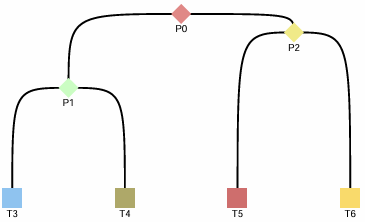

# Example of Simulated Data

In this tutorial, we demonstrate the basic usage of **LineageGRN** using simulated data. This example highlights how LineageGRN combines scATAC-seq and scRNA-seq data with cell lineage information to infer dynamic gene regulatory networks.

<!-- Workflow Visualization -->
<div style="text-align: center;">
  
</div>

---

## Data Generation

### 1. Time-scaled Cell Fate Map

In this example, we use the topology structure of a time-scaled fate map (represented by `fate_map_edge_dict` with 7 nodes/cell clusters) as input. We also set a state transition rate (`lambda`) to measure the probability that a child GRN inherits the known regulatory relationships of its parent GRN.

#### Load and Process Fate Map

```python
# Load the fate map topology from CSV and process it into a FateMap object.
fate_map_path = 'examples/data/simulation/input/edge_dict_simulation.csv'
edge_dict = load_fate_map_topology(fate_map_path)
edge = parse_edge_dict(edge_dict)
fate_map = FateMap(edge)
newick_format = generate_newick(fate_map)
```

**Sample Newick Format Output:**

```plaintext
'((T3:0.6,T4:0.6)P1:0.4,(T5:0.9,T6:0.9)P2:0.1)P0:0;'
```

#### Fate Map Visualization (Rscript)

```R
# Use R to generate a fate map plot.
Rscript plot_fate_map.R "((T3:0.6,T4:0.6)P1:0.4,(T5:0.9,T6:0.9)P2:0.1)P0:0;" 1.2 5 0.3 fate_map_plot.pdf
```

<div style="text-align: center;">
  
</div>

---

### 2. Ground Truth GRNs

#### Generate the Root GRN

- **Parameters**: 150 target genes, 100 regulators  
- **Output**: A pandas DataFrame `grn0` where:
  - **Rows**: represent regulators  
  - **Columns**: represent target genes  
  - **Elements**: range from -1 to 1, with the absolute value indicating regulatory strength, and the sign indicating activation (+) or repression (-)

```python
# Define output path for the ground truth GRN.
output_path = 'examples/results/simulation/extra_output/ground_truth_grn'

# Generate the root GRN.
grn0 = generate_root_grn(150, 100, output_path)
```

**Sample DataFrame Output:**

```plaintext
      0        1         2         3   ...   148       149
150  -0.7318   0.5520    0.0000    0.0000 ...   0.2533    0.0000
151   0.0000   0.3824    0.4575    0.4303 ...  -0.8496    0.0000
...
```

#### Generate Descendant GRNs

Load the dynamic GRN topology and generate descendant GRNs for each cell cluster based on the fate map.

```python
# Load additional GRN topology and generate descendant GRNs.
grn_dict_path = 'examples/data/simulation/additional_input_data/grn_dict.csv'
grn_dict = load_fate_map_topology(grn_dict_path)
decendent_grns = generate_descendant_grns(7, 150, 100, grn_dict, output_path, grn0)
```

---

### 3. scRNA-seq Data 

Generate expression data required by SERGIO. For each node, the output DataFrame has:
- **Rows**: regulators and target genes  
- **Columns**: sampled cells  
- **Elements**: gene expression values

```python
# Generate scRNA-seq expression data.
sergio_files_path = 'examples/results/simulation/extra_output/sergio_files'
output_path = 'examples/results/simulation/extra_output/expression_files'
generate_expression_data(decendent_grns, 7, 150, 100, 300, sergio_files_path, output_path, 1)
```

**Console Output (Sample):**

```plaintext
Start simulating new level
There are 100 genes to simulate in this layer
Done with current level
...
Start simulating new level
There are 150 genes to simulate in this layer
Done with current level
```

Convert the generated expression data into the LineageGRN input format. The final DataFrame includes five columns:  
`gene_id`, `cell_id`, `gene expression_value`, `node_id`, `gene_type` (target_gene or regulator_gene)

```python
# Convert expression files to LineageGRN input format.
input_file = 'examples/results/simulation/extra_output/expression_files'
output_file = 'examples/data/simulation/input/expression_data.csv'

# Load gene names.
target_genes_name = pd.read_csv('examples/data/simulation/additional_input_data/target_genes_name.csv')['x'].tolist()
regulatory_genes_name = pd.read_csv('examples/data/simulation/additional_input_data/regulatory_genes_name.csv')['x'].tolist()

convert_expression_file(150, target_genes_name, regulatory_genes_name, input_file, output_file)
```

**Sample Converted Data (First Few Rows):**

```plaintext
gene         cell      value   node_id    gene_type
target_0     cell_0    10.0    grn3       target_gene
target_0     cell_1    18.0    grn3       target_gene
target_0     cell_2    15.0    grn3       target_gene
...
```

---

### 4. scATAC-seq Data 

Generate scATAC-seq data as a pandas DataFrame with the following columns:  
`target_gene_id`, `regulator_id`, `co-accessibility score`, `node_id`

```python
# Generate scATAC-seq data.
output_path = '../data/simulation_data/test/input'
atac_data = generate_atac_data(decendent_grns, 7, 150, 100, output_path)
```

---

## Inference of Gene Regulatory Networks

Use the generated scATAC-seq and scRNA-seq data to infer GRNs.

```python
# Define input file paths.
atac_file_path = "examples/data/simulation/input/atac_data.csv"
expression_file_path = "examples/data/simulation/input/expression_data.csv"

# Setup GRN inference.
saved_dir = 'examples/results/simulation/inferred'
grns = FateMap(parse_edge_dict(grn_dict))
grn_inference = GRNInference(atac_file_path, expression_file_path, grns, saved_dir)

# Run GRN inference.
grn_inference.infer_grn()
```

**Sample Log Output:**

```plaintext
-2024-09-24 11:32:58,551-INFO-52272 Start fitting target_gene_id:1
-2024-09-24 11:34:56,762-INFO-25168 Finish inferencing leaves grn value for target_gene_id:1
-2024-09-24 11:34:56,763-INFO-25168 Saved grn values for target_gene_id:1
...
```

Retrieve target gene networks by setting a threshold (e.g., 0.1) to filter effective regulatory relationships.

```python
# Get target networks with a threshold of 0.1.
target_networks_dict = grn_inference.get_target_networks(0.1)
```

For an alternative output format, generate a dictionary where:
- **Key**: `node_id`  
- **Value**: A DataFrame with rows for target genes and columns for regulators

```python
# Generate dynamic networks for each fate map node.
dynamic_networks_dict = get_dynamic_networks(saved_dir, grns, 0.1, regulatory_genes_name, target_genes_name)
```

#### Visualizing the Fate Map Path

You can visualize the inferred GRN along a specific path using the `.get_path` method.

```python
# Example: Get the path for node 'grn5'.
path = grns.get_path('grn5')
print(path)  # Expected output: ['grn0', 'grn2', 'grn5']
```

Extract and format the GRN along the selected path into a three-column DataFrame using `get_gene_interaction`.

```python
# Extract networks for grn0, grn2, and grn5.
network0 = dynamic_networks_dict['grn0']
network2 = dynamic_networks_dict['grn2']
network5 = dynamic_networks_dict['grn5']

# Assign gene names to columns and index.
network0.columns = network2.columns = network5.columns = regulatory_genes_name
network0.index = network2.index = network5.index = target_genes_name

# Get gene interactions.
gene0_interaction = get_gene_interaction(network0)
gene2_interaction = get_gene_interaction(network2)
gene5_interaction = get_gene_interaction(network5)

# Save interaction results.
gene0_interaction.to_csv('examples/results/simulation/extra_output/gene0_interaction.csv', header=None)
gene2_interaction.to_csv('examples/results/simulation/extra_output/gene2_interaction.csv', header=None)
gene5_interaction.to_csv('examples/results/simulation/extra_output/gene5_interaction.csv', header=None)
```

Visualize GRNs on the selected pathways using R scripts:

```R
# Plot GRN for grn0.
Rscript plot_grn.R examples/results/simulation/extra_output/expression_files/Exp_grn5.csv \
examples/data/simulation/additional_input_data/target_genes_name.csv \
examples/data/simulation/additional_input_data/regulatory_genes_name.csv \
examples/results/simulation/extra_output/gene0_interaction.csv grn0_plot.pdf

# Plot GRN for grn2.
Rscript plot_grn.R examples/results/simulation/extra_output/expression_files/Exp_grn5.csv \
examples/data/simulation/additional_input_data/target_genes_name.csv \
examples/data/simulation/additional_input_data/regulatory_genes_name.csv \
examples/results/simulation/extra_output/gene2_interaction.csv grn2_plot.pdf

# Plot GRN for grn5.
Rscript plot_grn.R examples/results/simulation/extra_output/expression_files/Exp_grn5.csv \
examples/data/simulation/additional_input_data/target_genes_name.csv \
examples/data/simulation/additional_input_data/regulatory_genes_name.csv \
examples/results/simulation/extra_output/gene5_interaction.csv grn5_plot.pdf
```

<div style="text-align: center;">
  
</div>

---

## Validation of LineageGRN Performance

Traverse all fate map nodes to compute AUROC and AUPRC by comparing inferred GRNs with the ground truth.

```python
# Evaluate performance for each fate map node.
nodes = list(fate_map.nodes.keys())
auroc_list = []
auprc_list = []

for node_id in nodes:
    grn_infer = dynamic_networks_dict[node_id]
    grn_true = pd.read_csv('examples/data/simulation/extra_output/ground_truth_grn/' + node_id + '.csv')
    grn_true = grn_true.T  # Transpose for comparison
    auroc = compute_auroc(grn_infer, grn_true, 0.1)
    auprc = compute_auprc(grn_infer, grn_true, 0.1)
    print([node_id, auroc, auprc])
    auroc_list.append([node_id, auroc])
    auprc_list.append([node_id, auprc])

# Create DataFrames for evaluation metrics.
auroc_df = pd.DataFrame(auroc_list, columns=['node_id', 'value'])
auprc_df = pd.DataFrame(auprc_list, columns=['node_id', 'value'])

# Save evaluation results.
auprc_df.to_csv('examples/results/simulation/evaluation_result/auprc.csv', index=False)
auroc_df.to_csv('examples/results/simulation/evaluation_result/auroc.csv', index=False)
```

**Sample Output:**

```plaintext
['grn0', 0.5994519770589117, 0.6717228828294495]
['grn1', 0.6709248585954783, 0.712408224107377]
...
```

Visualize the evaluation metrics using R:

```R
# Plot AUROC.
Rscript plot_AUC.R "((grn3:0.6,grn4:0.6)grn1:0.4,(grn5:0.9,grn6:0.9)grn2:0.1)grn0:0;" \
examples/results/simulation/evaluation_result/auroc.csv AUROC_plot.pdf TRUE

# Plot AUPRC.
Rscript plot_AUC.R "((grn3:0.6,grn4:0.6)grn1:0.4,(grn5:0.9,grn6:0.9)grn2:0.1)grn0:0;" \
examples/results/simulation/evaluation_result/auprc.csv AUPRC_plot.pdf TRUE
```

<div style="text-align: center;">
  
  
</div>

---


