# Example of Caenorhabditis elegans Dataset 
***

In this tutorial, we demonstrate how to use **LineageGRN** on a *Caenorhabditis elegans* (C.elegans) dataset. This dataset comprises:

- **Cell lineage information**: A well-established developmental lineage map for C. elegans.  
- **scRNA-seq data**: Single-cell transcriptomic profiles capturing the expression of genes across developmental stages.  
- **scATAC-seq data**: Chromatin accessibility profiles providing complementary information on regulatory region activity.

From the combined single-cell transcriptomic and chromatin accessibility measurements, we identified:
- **244 regulatory genes**  
- **339 target genes**

<p align="center">
  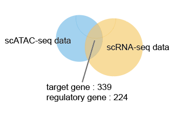
</p>

We denote this dataset as **full dataset**, which allows us to perform a comprehensive or “global” gene regulatory network (GRN) inference. By using the full set of regulatory genes and target genes, we can:

1. Capture the broad regulatory relationships across the developmental landscape of C. elegans.
2. Thoroughly evaluate the performance of LineageGRN.

After establishing the overall framework and validating the algorithm on the full dataset, we select a subset of:
- **34 regulatory genes**  
- **41 target genes**

<p align="center">
  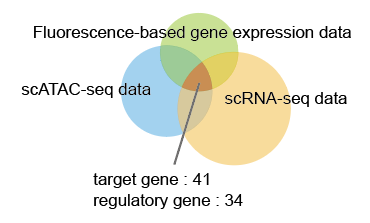
</p>

By narrowing the scope to these core regulators, we can more easily:

1. **Track reconfiguration patterns** of regulatory networks along the cell fate map.  
2. **Identify key drivers** of cell differentiation.  
3. **Identify key drivers** of cell fate bias.  
4. Investigate both **specific and constitutive** regulatory interactions among the most influential genes.

This **comprehensive-to-focused** strategy first confirms LineageGRN’s effectiveness across the broad regulatory landscape, then leverages a smaller, targeted subset to deepen insights into how key regulatory factors orchestrate cellular transitions and lineage decisions—ultimately enhancing both the robustness and interpretability of our findings.

---

## Data Acquisition

### Time-Scaled Cell Fate Map
- [Cell lineage tree](https://www.ncbi.nlm.nih.gov/geo/query/acc.cgi?acc=GSE126954) capturing the cell division dynamics throughout C.elegans development.

### scRNA-seq Data
- [Raw scRNA-seq data](https://www.ncbi.nlm.nih.gov/geo/query/acc.cgi?acc=GSE126954) providing gene expression profiles across diverse C.elegans cell types.

### Fluorescence-Based Gene Expression Data
- [Fluorescence-based gene expression data](https://epic.gs.washington.edu) obtained through time-resolved microscopic imaging, enabling precise quantification of gene expression dynamics at single-cell resolution in C.elegans.

### scATAC-seq Data
- [Raw scATAC-seq data](https://www.ncbi.nlm.nih.gov/geo/query/acc.cgi?acc=GSE157017) providing chromatin accessibility profiles across all tissues in C.elegans.

---

## Data Preprocessing

### Time-scaled Cell Fate Map

In this example, we utilize the well-established cell lineage tree of C.elegans. The lineage tree consists of six subtrees, each representing a distinct cell fate map.

Taking the EMS lineage as an example, the topological structure of the cell fate map is provided using the `Dict` data type. The process involves the following steps:

1. **Load the topology data** from a CSV file containing edge information.
2. **Parse the edge dictionary** to extract the relationships between cells.
3. **Instantiate the `FateMap` object**, which generates the final fate map based on the provided topology.

```python
# Load cell lineage topology data
map_df = pd.read_csv('examples/data/C.elegans/C.elegans_Full/additional_input_data/fate_map_topology.csv')
edges_dict_Celegans = {}

for top_key, group in map_df.groupby("Lineage"):
    sub_dict = {f"{row['Parent']}->{row['Child']}": row['Length'] for _, row in group.iterrows()}
    edges_dict_Celegans[top_key] = sub_dict

# Process each subtree
# ABpr
edges_ABpr = parse_edge_dict(edges_dict_Celegans['ABpr'])
fate_map_ABpr = FateMap(edges_ABpr)

# ABpl
edges_ABpl = parse_edge_dict(edges_dict_Celegans['ABpl'])
fate_map_ABpl = FateMap(edges_ABpl)

# ABar
edges_ABar = parse_edge_dict(edges_dict_Celegans['ABar'])
fate_map_ABar = FateMap(edges_ABar)

# ABal
edges_ABal = parse_edge_dict(edges_dict_Celegans['ABal'])
fate_map_ABal = FateMap(edges_ABal)

# EMS
edges_EMS = parse_edge_dict(edges_dict_Celegans['EMS'])
fate_map_EMS = FateMap(edges_EMS)

# P2
edges_P2 = parse_edge_dict(edges_dict_Celegans['P2'])
fate_map_P2 = FateMap(edges_P2)
```

<p align="center">
  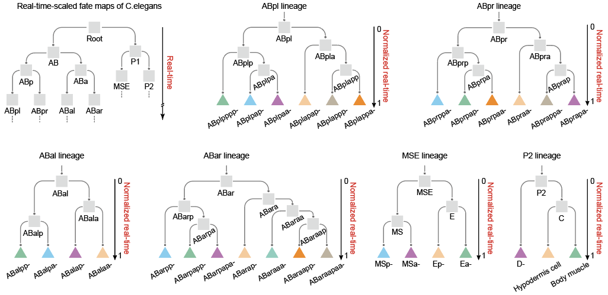
</p>

### scRNA-seq Data

#### Preprocessing Steps

1. **Quality Control**:
   - Remove cells with low gene expression levels or signs of cell death.
2. **Highly Variable Genes (Optional)**:
   - Select highly variable genes for further analysis.
3. **Normalization**:
   - Normalize gene expression levels so that each cell's gene expression has zero mean and unit variance.

#### References and Tools Used
- [Scanpy](https://scanpy.readthedocs.io/) or [Seurat](https://satijalab.org/seurat/): Used for quality control, normalization, and selection of highly variable genes.

#### Preprocessed Formats
- **Columns**:
  - `Gene Name`: Name of the gene (e.g., GENE_A).  
  - `Cell Name`: Unique identifier for each cell.  
  - `Gene Expression`: Normalized gene expression value.  
  - `Cell Cluster ID/Cell Type`: Cluster or cell type label.  
  - `Gene Type`: Either `Regulatory Gene` or `Target Gene`.

### scATAC-seq Data

#### Preprocessing Steps

1. **Chromatin Co-accessibility Analysis**  
   - Process raw data using the `cicero` package to identify chromatin fragments (`peak1` and `peak2`) and compute a co-accessibility score.
   - Remove rows with a `co-access score` less than 0.1.
2. **Peak-to-Gene Mapping**  
   - Map `peak2` fragments to gene IDs and further to gene names (target genes).
3. **Motif Identification**  
   - Perform motif scanning on `peak1` regions to identify regulatory genes.
4. **Regulatory Network Construction**  
   - Establish links:
     - One `peak1` to **multiple regulatory genes**.
     - One `peak2` to **one target gene**.
     - The co-accessibility score reflects the shared regulatory relationship strength.

#### References and Tools Used
- [CIS-BP Database](https://cisbp.ccbr.utoronto.ca/)
- [BSgenome.Celegans.UCSC.ce10 R package](https://www.bioconductor.org/packages/release/data/annotation/html/BSgenome.Celegans.UCSC.ce10.html)
- [Cicero R package](https://cole-trapnell-lab.github.io/cicero-release/)
- [Motifmatchr R package](https://bioconductor.org/packages/motifmatchr)

#### Preprocessed Formats
- **Columns**:
  - `Regulatory Gene`: Derived from motif scanning on `peak1`.
  - `Target Gene`: Based on genomic position annotation of `peak2`.
  - `Co-access Score`: Regulatory relationship strength.
  - `Cell Cluster ID/Cell Type`: Provides context for the regulatory relationship.

---

## Inference of Gene Regulatory Networks

This step inputs the preprocessed data files.

```python
# Define file paths for EMS lineage 
atac_file_path = "examples/data/C.elegans/C.elegans_Full/input_data/EMS/atac_data.csv"
expression_file_path = "examples/data/C.elegans/C.elegans_Full/input_data/EMS/expression_data.csv"
```

This step generates a dataframe for each target gene with the following structure:

- **Rows**: Correspond to cell clusters.  
- **Columns**: Correspond to regulatory genes.
  - **Column 1**: Target gene name.
  - **Column 2**: Cell cluster ID (node in the regulatory network).
  - **Column 3~n**: Regulatory relationships between the target gene and its regulators (regulatory strength and mode).

### GRN Inference for Different Lineages

```python
## setup
target_genes_name=pd.read_csv("examples/data/C.elegans/C.elegans_Full/additional_input_data/target_genes_name.csv").iloc[:,1].to_list()
regulatory_genes_name=pd.read_csv("examples/data/C.elegans/C.elegans_Full/additional_input_data/regulatory_genes_name.csv").iloc[:,1].to_list()

output_path='examples/results/C.elegans/C.elegans_Full/figures/'

tar_num=len(target_genes_name)
```

GRN inference

```python
edges_ABpr = parse_edge_dict(edges_dict_Celegans['ABpr'])
fate_map_ABpr = FateMap(edges_ABpr)
atac_file_path_ABpr = "examples/data/C.elegans/C.elegans_Full/input_data/ABpr/atac_data.csv"
expression_file_path_ABpr = "examples/data/C.elegans/C.elegans_Full/input_data/ABpr/expression_data.csv"

saved_dir_ABpr = 'examples/results/C.elegans/C.elegans_Full/ABpr'

grn_inference_result = GRNInference(atac_file_path_ABpr, expression_file_path_ABpr, fate_map_ABpr, saved_dir_ABpr)
grn_inference_result.infer_grn(20)

ABpr_grn_dict = get_dynamic_networks(saved_dir_ABpr, fate_map_ABpr, 0, regulatory_genes_name, target_genes_name)

## ABpl
edges_ABpl = parse_edge_dict(edges_dict_Celegans['ABpl'])
fate_map_ABpl = FateMap(edges_ABpl)
atac_file_path_ABpl = "examples/data/C.elegans/C.elegans_Full/input_data/ABpl/atac_data.csv"
expression_file_path_ABpl = "examples/data/C.elegans/C.elegans_Full/input_data/ABpl/expression_data.csv"

saved_dir_ABpl = 'examples/results/C.elegans/C.elegans_Full/ABpl'

grn_inference_result = GRNInference(atac_file_path_ABpl, expression_file_path_ABpl, fate_map_ABpl, saved_dir_ABpl)
grn_inference_result.infer_grn(20)

ABpl_grn_dict = get_dynamic_networks(saved_dir_ABpl, fate_map_ABpl, 0, regulatory_genes_name, target_genes_name)

## ABar
edges_ABar = parse_edge_dict(edges_dict_Celegans['ABar'])
fate_map_ABar = FateMap(edges_ABar)
atac_file_path_ABar = "examples/data/C.elegans/C.elegans_Full/input_data/ABar/atac_data.csv"
expression_file_path_ABar = "examples/data/C.elegans/C.elegans_Full/input_data/ABar/expression_data.csv"

saved_dir_ABar = 'examples/results/C.elegans/C.elegans_Full/ABar'

grn_inference_result = GRNInference(atac_file_path_ABar, expression_file_path_ABar,fate_map_ABar, saved_dir_ABar)
grn_inference_result.infer_grn(20)

ABar_grn_dict = get_dynamic_networks(saved_dir_ABar,fate_map_ABar,0,regulatory_genes_name, target_genes_name)

## ABal
edges_ABal = parse_edge_dict(edges_dict_Celegans['ABal'])
fate_map_ABal= FateMap(edges_ABal)
atac_file_path_ABal = "examples/data/C.elegans/C.elegans_Full/input_data/ABal/atac_data.csv"
expression_file_path_ABal = "examples/data/C.elegans/C.elegans_Full/input_data/ABal/expression_data.csv"

saved_dir_ABal = 'examples/results/C.elegans/C.elegans_Full/ABal'

grn_inference_result = GRNInference(atac_file_path_ABal, expression_file_path_ABal,fate_map_ABal, saved_dir_ABal)
grn_inference_result.infer_grn(20)

ABal_grn_dict = get_dynamic_networks(saved_dir_ABal, fate_map_ABal, 0, regulatory_genes_name, target_genes_name)

## EMS
edges_EMS = parse_edge_dict(edges_dict_Celegans['EMS'])
fate_map_EMS = FateMap(edges_EMS)
atac_file_path_EMS = "examples/data/C.elegans/C.elegans_Full/input_data/EMS/atac_data.csv"
expression_file_path_EMS = "examples/data/C.elegans/C.elegans_Full/input_data/EMS/expression_data.csv"

saved_dir_EMS = 'examples/results/C.elegans/C.elegans_Full/EMS'

grn_inference_result = GRNInference(atac_file_path_EMS, expression_file_path_EMS, fate_map_EMS, saved_dir_EMS)
grn_inference_result.infer_grn(20)

EMS_grn_dict = get_dynamic_networks(saved_dir_EMS, fate_map_EMS, 0, regulatory_genes_name, target_genes_name)

## P2
edges_P2 = parse_edge_dict(edges_dict_Celegans['P2'])
fate_map_P2 = FateMap(edges_P2)
atac_file_path_P2 = "examples/data/C.elegans/C.elegans_Full/input_data/P2/atac_data.csv"
expression_file_path_P2 = "examples/data/C.elegans/C.elegans_Full/input_data/P2/expression_data.csv"

saved_dir_P2 = 'examples/results/C.elegans/C.elegans_Full/P2'

grn_inference_result = GRNInference(atac_file_path_P2, expression_file_path_P2, fate_map_P2, saved_dir_P2)
grn_inference_result.infer_grn(20)

P2_grn_dict = get_dynamic_networks(saved_dir_P2, fate_map_P2, 0, regulatory_genes_name, target_genes_name)

```

```plaintext
2024-09-24 11:32:58,551 - INFO - 52272 Start fitting target_gene_id:eef-1A.1
2024-09-24 11:34:56,762 - INFO - 25168 Finish inferencing leaves grn value for target_gene_id:eef-1A.1
2024-09-24 11:34:56,763 - INFO - 25168 Saved grn values for target_gene_id:eef-1A.1
...
```

---

## Validation of LineageGRN Performance

1. **Input Measured Expression**:  
   Input the gene expression matrix of progenitor cell types.

```python
import os
import pandas as pd

base_path = 'examples/data/C.elegans/C.elegans_Full/additional_input_data'

file_names = [
    'ABprp_count_matrix.csv',
    'ABprap_count_matrix.csv',
    'ABara_count_matrix.csv',
    'ABaraap_count_matrix.csv',
    'ABplpa_count_matrix.csv',
    'ABalp_count_matrix.csv',
    'ABala_count_matrix.csv',
    'ABplapp_count_matrix.csv',
    'ABplp_count_matrix.csv',
    'ABarp_count_matrix.csv',
    'ABarpa_count_matrix.csv',
    'ABprpa_count_matrix.csv'
]
count_matrices = {}

for file in file_names:
    key = os.path.splitext(file)[0]
    count_matrices[key] = pd.read_csv(os.path.join(base_path, file), index_col=0
```

This step normalizes the expression matrix and splits it into target gene expression and regulatory gene expression matrices.

```python
# Example for ABprp
ABprp_norm_count_matrix = normalize_to_zero_mean(count_matrices["ABprp_count_matrix"])
ABprp_tar = ABprp_norm_count_matrix.iloc[range(tar_num), :]
ABprp_reg = ABprp_norm_count_matrix.iloc[tar_num:, :]

ABprap_norm_count_matrix = normalize_to_zero_mean(count_matrices["ABprap_count_matrix"])
ABprap_tar = ABprap_norm_count_matrix.iloc[range(tar_num), :]
ABprap_reg = ABprap_norm_count_matrix.iloc[tar_num:, :]

ABara_norm_count_matrix = normalize_to_zero_mean(count_matrices["ABara_count_matrix"])
ABara_tar = ABara_norm_count_matrix.iloc[range(tar_num), :]
ABara_reg = ABara_norm_count_matrix.iloc[tar_num:, :]

ABaraap_norm_count_matrix = normalize_to_zero_mean(count_matrices["ABaraap_count_matrix"])
ABaraap_tar = ABaraap_norm_count_matrix.iloc[range(tar_num), :]
ABaraap_reg = ABaraap_norm_count_matrix.iloc[tar_num:, :]

ABplpa_norm_count_matrix = normalize_to_zero_mean(count_matrices["ABplpa_count_matrix"])
ABplpa_tar = ABplpa_norm_count_matrix.iloc[range(tar_num), :]
ABplpa_reg = ABplpa_norm_count_matrix.iloc[tar_num:, :]

ABalp_norm_count_matrix = normalize_to_zero_mean(count_matrices["ABalp_count_matrix"])
ABalp_tar = ABalp_norm_count_matrix.iloc[range(tar_num), :]
ABalp_reg = ABalp_norm_count_matrix.iloc[tar_num:, :]
```

### Expression Prediction

This step infers target gene expression levels of progenitor cell types using linear regression models.

```python
import numpy as np

ABprp_grn = np.array(ABpr_grn_dict['ABprp'])
ABprap_grn = np.array(ABpr_grn_dict['ABprap'])
ABara_grn = np.array(ABar_grn_dict['ABara'])
ABaraap_grn = np.array(ABar_grn_dict['ABaraap'])
ABplpa_grn = np.array(ABpl_grn_dict['ABplpa'])
ABalp_grn = np.array(ABal_grn_dict['ABalp'])

ABprp_inf_tar = pd.DataFrame(ABprp_grn @ np.array(ABprp_reg))
ABprap_inf_tar = pd.DataFrame(ABprap_grn @ np.array(ABprap_reg))
ABara_inf_tar = pd.DataFrame(ABara_grn @ np.array(ABara_reg))
ABaraap_inf_tar = pd.DataFrame(ABaraap_grn @ np.array(ABaraap_reg))
ABplpa_inf_tar = pd.DataFrame(ABplpa_grn @ np.array(ABplpa_reg))
ABalp_inf_tar = pd.DataFrame(ABalp_grn @ np.array(ABalp_reg))

# Set target gene names as index
ABprp_inf_tar.index = ABprap_inf_tar.index = ABara_inf_tar.index = ABaraap_inf_tar.index = ABplpa_inf_tar.index = ABalp_inf_tar.index = target_genes_name
```

### High Expression Analysis

This step identifies the high-expression target genes for progenitor cell types using the measured and predicted expression data.

```python
ABprp_high_expression_tar_infer = count_greater_than_threshold(
    ABprp_inf_tar, -count_matrices["ABprp_count_matrix"].values.mean()
)
ABprp_high_expression_tar = count_greater_than_threshold(
    ABprp_tar, -count_matrices["ABprp_count_matrix"].values.mean()
)

ABprap_high_expression_tar_infer = count_greater_than_threshold(
    ABprap_inf_tar, -count_matrices["ABprap_count_matrix"].values.mean()
)
ABprap_high_expression_tar = count_greater_than_threshold(
    ABprap_tar, -count_matrices["ABprap_count_matrix"].values.mean()
)

ABara_high_expression_tar_infer = count_greater_than_threshold(
    ABara_inf_tar, -count_matrices["ABara_count_matrix"].values.mean()
)
ABara_high_expression_tar = count_greater_than_threshold(
    ABara_tar, -count_matrices["ABara_count_matrix"].values.mean()
)

ABaraap_high_expression_tar_infer = count_greater_than_threshold(
    ABaraap_inf_tar, -count_matrices["ABaraap_count_matrix"].values.mean()
)
ABaraap_high_expression_tar = count_greater_than_threshold(
    ABaraap_tar, -count_matrices["ABaraap_count_matrix"].values.mean()
)

ABplpa_high_expression_tar_infer = count_greater_than_threshold(
    ABplpa_inf_tar, -count_matrices["ABplpa_count_matrix"].values.mean()
)
ABplpa_high_expression_tar = count_greater_than_threshold(
    ABplpa_tar, -count_matrices["ABplpa_count_matrix"].values.mean()
)

ABalp_high_expression_tar_infer = count_greater_than_threshold(
    ABalp_inf_tar, -count_matrices["ABalp_count_matrix"].values.mean()
)
ABalp_high_expression_tar = count_greater_than_threshold(
    ABalp_tar, -count_matrices["ABalp_count_matrix"].values.mean()
)
```

### Matching

```python
data_inf = [
    ABalp_high_expression_tar_infer,
    ABplpa_high_expression_tar_infer,
    ABaraap_high_expression_tar_infer,
    ABara_high_expression_tar_infer,
    ABprap_high_expression_tar_infer,
    ABprp_high_expression_tar_infer
]

data_real = [
    ABalp_high_expression_tar,
    ABplpa_high_expression_tar,
    ABaraap_high_expression_tar,
    ABara_high_expression_tar,
    ABprap_high_expression_tar,
    ABprp_high_expression_tar
]
```

Output the matching result and visualization

```
norm_sums, loss_value, norm_value, perm_choice, sorted_perms = match_ExpData(data_inf, data_real, 1, 10000)
identity = tuple(range(len(data_inf)))
identity_idx = sorted_perms.index(identity) 

case_ids = np.arange(1, len(norm_sums) + 1)

plt.figure(figsize=(2.5, 1.5))

plt.bar(case_ids, norm_sums, color='#A8CDD9', width=1.0)

plt.bar(identity_idx + 1,
        norm_sums[identity_idx],
        color='red',
        edgecolor='darkred',
        linewidth=2.5,
        width=1.0)

plt.xlabel("Case ID (sorted by ascending loss)", fontsize=5, fontname='Arial')
plt.ylabel("Normalized loss", fontsize=5, fontname='Arial')
plt.xticks(ticks=np.arange(0, len(norm_sums)+1, 40), fontsize=5, fontname='Arial',rotation=90)
plt.yticks(ticks=np.linspace(0,1,6), fontsize=5, fontname='Arial')
plt.tick_params(axis='x', length=0.2)
plt.tick_params(axis='y', length=0.2)
plt.tight_layout()
plt.savefig(output_path+'matching_result_small.eps', format='eps', bbox_inches='tight')
plt.show()
```

<p align="center">
  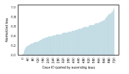
</p>

```python
print("The minimum loss function:", loss_value)
print("The minimum loss function (normalized):", norm_value)
print("The permutation corresponding to the minimum loss function (column index selected for each row, counting starting from 0):", perm_choice)
```

```plaintext
The minimum loss function: 1205.0
The minimum loss function (normalized): 0.0
The permutation corresponding to the minimum loss function (column index selected for each row, counting starting from 0): (0, 1, 2, 3, 4, 5)
```
---

## Downstream Analysis

We focus on the smaller, targeted subset comprising 34 regulatory genes and 41 target genes to gain deeper insights into how key regulatory factors orchestrate cell fate decisions.

### Revealing the Structural Dynamics of GRNs

```python
regulatory_gene_dict = get_regulators('nhr-25', 'Ea-', saved_dir, regulator_names)
```

```plaintext
{'ceh-16': 0.3416499361653389, 'ceh-32': 0.5666916385389806, 'nhr-23': -0.4925718598273363, 'nhr-2': 0.24816905174646298, 'ceh-27': 0.1109726233953044, 'mab-5': -0.5323998868840484, 'nob-1': 0.23886076979862184, 'ceh-36': 0.5233501635329588, 'lin-1': 0.2897392528846144, 'eor-1': -0.4594620129243684, 'elt-2': 0.2976629236568841, 'irx-1': -0.13928695618132647, 'pal-1': 0.2489742931460235, 'nhr-79': -0.254491892554381, 'nhr-67': -0.27121213967865765, 'pha-4': 0.27487150765088963, 'nhr-25': 0.30274213501027825, 'dpl-1': 0.18021229240405684, 'hlh-16': 0.16969014424893344, 'elt-1': 0.36983762199901216, 'die-1': -0.8442123287166449, 'mnm-2': 0.7498769338962882, 'ref-2': 0.3727797808889699, 'lsy-27': -0.1369907430615935, 'B0310.2': -0.6490667615035224, 'dmd-4': -0.6883133898208357, 'end-1': 0.33351354696441643, 'end-3': -0.3033015231479436, 'tbx-37': 0.13312002995799968, 'hlh-1': 0.20481617473191782, 'ref-1': 0.3388880575957087, 'egl-5': -0.32889328111019744, 'elt-7': 0.2227128886808342, 'hlh-26': 0.19039319833013132}
```

```python
target_gene_dict = get_target_genes('elt-7', 'Ea-', saved_dir, regulator_names)
```

```plaintext
{'ama-1': 0.12514667502715765, 'B0310.2': -0.5690056949430876, 'B0336.3': -0.20087389262169697, 'ceh-16': 0.20728454926555562, 'ceh-27': -0.37076693848880266, 'ceh-43': 0.14481679327711647, 'die-1': 0.3327874528028564, 'dpl-1': 0.9878740137951658, 'dpy-31': 0.12992381853423898, 'dpy-7': 0.32438275516616405, 'dve-1': -0.28369422531295474, 'eef-1A.1': 0.13208107870118843, 'elt-1': 0.1485771897337543, 'elt-6': -0.3187646539838563, 'elt-7': -0.1953150517426333, 'F16B12.6': 0.13044802075213238, 'his-72': -0.1813583591231202, 'hlh-1': 0.2157784109364843, 'hmg-1.2': -0.13887148392408816, 'hmg-11': 0.09813520413087781, 'hsp-3': 0.24737695149461586, 'irx-1': -0.2025020427447795, 'isw-1': 0.05843540247802143, 'lin-1': 0.3000627454486636, 'lin-11': -0.034702965083833526, 'lin-13': 0.07181059724759799, 'lin-26': 0.14910339699633657, 'lin-39': 0.047706651933201984, 'lir-2': -0.006536041410562453, 'mab-5': -0.05103641530899973, 'mep-1': 0.2284986996612302, 'mml-1': -0.13379086742843393, 'nhr-23': 0.2373577819074984, 'nhr-25': 0.2227128886808342, 'nhr-49': 0.0037408606991700503, 'nhr-57': 0.13837017790147818, 'nhr-68': -0.3052208724250098, 'nob-1': 0.10537876339917188, 'pbrm-1': 0.22186185639658834, 'sma-9': 0.1577509253281303, 'tps-2': 0.17392960836027058}
```

**Visualization Examples**

1. **Visualization of the Changes in the Number of Negative Regulations**  
   Plot the negative regulatory interactions for each target gene along the fate map.

```python
ordered_genes = regulatory_number_rank(target_gene_names, regulator_names, 'total', saved_dir, path, 0.1)
plot_target_genes_along_fatemap(ordered_genes, regulator_names, 'negative', saved_dir, path, 0.1, output_path)
```

<p align="center">
  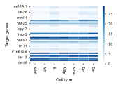
</p>

2. **Visualization of the Changes in the Number of Positive Regulations**  
   Plot the positive regulatory interactions for each target gene along the fate map.

```python
plot_target_genes_along_fatemap(ordered_genes, regulator_names, 'positive', saved_dir, path, 0.1, output_path)
```

<p align="center">
  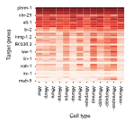
</p>

3. **Visualization of the Changes in the Total Number of Regulations**  
   Plot the total number of regulatory interactions for each target gene along the fate map.

```python
plot_target_genes_along_fatemap(ordered_genes, regulator_names, 'total',saved_dir, path, 0.1, output_path)
```

<p align="center">
  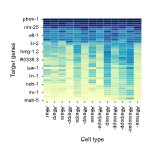
</p>

4. **Visualization of the Dynamic Regulatory Networks for 'elt-7'**  
   Plot the dynamic regulatory network of the regulatory gene 'elt-7' along the fate map.

```python
plot_regulatory_network_along_fatemap('elt-7', dynamic_networks_dict, path, output_path, 0.1, figsize=(16,2))
```

<p align="center">
  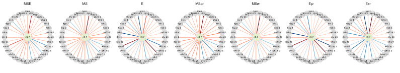
</p>

5. **Visualization of Regulatory Strength on the Fate Map Path**  
   Plot the changes in regulatory strength of each regulatory gene on the fate map path (with 'Ea-' as the leaf node) for the target gene 'nhr-25'.

```python
path = fate_map.get_path("Ea-")
plot_regulatory_strength_along_fatemap(saved_dir, path, regulator_names, 'nhr-25', output_path)
```

<p align="center">
  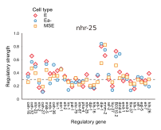
</p>

6. **Visualization of Regulator Activity Across Lineages**  
   Plot the comparison of the activity of the regulatory gene 'nhr-25' at different nodes of different fate maps.

```python
map_df = pd.read_csv('examples/data/C.elegans/C.elegans_Core/additional_input_data/fate_map_topology.csv')
edges_dict_Celegans = {}

for top_key, group in map_df.groupby("Lineage"):
    sub_dict = {f"{row['Parent']}->{row['Child']}": row['Length'] for _, row in group.iterrows()}
    edges_dict_Celegans[top_key] = sub_dict

input_path = os.path.dirname(saved_dir)
plot_regulator_activity_across_lineages(edges_dict_Celegans, input_path, 'nhr-25', regulator_names, 0.35, output_path)
```

<p align="center">
  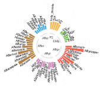
</p>

### Identifying Key Genes Driving Differentiation

```python
key_regulators_df_concat = pd.DataFrame()
for lineage in edges_dict_Celegans.keys():
    edges = parse_edge_dict(edges_dict_Celegans[lineage])
    fatemap = FateMap(edges, high_expression_genes[lineage])
    nodes = fatemap.node_internals[::-1] + [fatemap.node_root]
    for node in nodes:
        input_path = os.path.join(os.path.dirname(saved_dir), lineage)
        key_regulators = identify_key_genes_differentiation(input_path, fatemap, 0.05, regulator_names, target_gene_names, node)
        high_expression_genes_of_ancestor_node = list(
            set(key_regulators.loc[((key_regulators['DRS'] > 0.2) & (key_regulators['DRC'] > 0.7)), 'regulator_id']) & set(target_gene_names)
        )
        high_expression_genes[lineage][node] = high_expression_genes_of_ancestor_node
        fatemap = FateMap(edges, high_expression_genes[lineage])
        key_regulators_df_concat = pd.concat([key_regulators_df_concat, key_regulators])
```

```plaintext
regulator_id    positive_regulatory_strength  positive_regulation_number  negative_regulation_number  DRS       DRC  node_id
ceh-16          3.571054                       9.0                         0.0                         0.396784  1.0  E
ceh-36          3.414377                       9.0                         0.0                         0.379375  1.0  E
nhr-2           3.340567                       8.0                         0.0                         0.417571  1.0  E
elt-7           3.424669                       7.0                         0.0                         0.489238  1.0  E
nhr-79          2.417552                       6.0                         0.0                         0.402925  1.0  E
...             ...                            ...                         ...                         ...       ...  ...
nhr-67          0.034049                       4.0                         4.0                         0.008512  0.5  P2
```

**Visualization of Key Gene Differentiation**

```python
nodes = list(key_regulators_df_concat['node_id'].drop_duplicates())
plot_key_genes_differentiation(key_regulators_df_concat, nodes, regulator_names, output_path, figsize=(5,2.5))
```

<p align="center">
  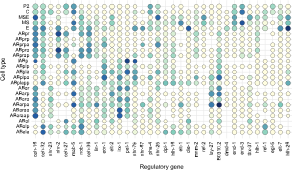
</p>

### Identifying Key Regulatory Genes Driving Cell Fate Bias

!!! tip
    To identify key genes driving cell fate divergence, it is essential to determine the difference in highly expressed target genes between sibling cell types. Therefore, we utilize the larger dataset, which includes 244 regulatory genes and 339 target genes, for key gene identification. However, during the result analysis, we remain focused on a subset of 39 regulatory genes to ensure a more targeted and interpretable analysis.

This step identifies the high expression target genes in each leaf node of the cell fate map (sampled cell types).

```python
groups = {
    'ABar': {
        'names': ['ABarpp-', 'ABarap-', 'ABarpapp-', 'ABarpapa-', 'ABaraaa-', 'ABaraapp-', 'ABaraapaa-'],
        'extra_keys': ['ABarp', 'ABarpa', 'ABara', 'ABaraa', 'ABaraap', 'ABar']
    },
    'ABpr': {
        'names': ['ABprppa-', 'ABprpap-', 'ABprpaa-', 'ABpraa-', 'ABprappa-', 'ABprapa-'],
        'extra_keys': ['ABprp', 'ABprpa', 'ABprapp', 'ABpra', 'ABpr', 'ABprap']
    },
    'ABpl': {
        'names': ['ABplpppp-', 'ABplpap-', 'ABplpaa-', 'ABplapap-', 'ABplappp-', 'ABplappa-'],
        'extra_keys': ['ABplp', 'ABplpa', 'ABpla', 'ABplapp', 'ABpl']
    },
    'ABal': {
        'names': ['ABalpp-', 'ABalpa-', 'ABalap-', 'ABalaa-'],
        'extra_keys': ['ABalp', 'ABala', 'ABal']
    }
}

base_path = 'examples/data/C.elegans/C.elegans_Full/additional_input_data'
gene_expression_matrices = {}
high_expression_genes = {}

for group, info in groups.items():
    group_dict = {}
    for name in info['names']:
        file_path = f'{base_path}/{name}_count_matrix.csv'
        df = pd.read_csv(file_path, index_col=0)
        gene_expression_matrices[name] = df
        genes_var_name = name
        group_dict[genes_var_name] = [i for i in get_high_expression_genes(df) if i in target_genes_name]
    for key in info['extra_keys']:
        group_dict[key] = None
    high_expression_genes[group] = group_dict
```

Display partial key regulatory gene inference results.

```python
regulatory_gene_filter = list(pd.read_csv('examples/data/C.elegans/C.elegans_Core/additional_input_data/regulatory_genes_name.csv', index_col=0).iloc[:,0])
```

Take lineage ABpr as an example.

```python
edges = parse_edge_dict(edges_dict_Celegans['ABpr'])
fate_map = FateMap(edges, high_expression_genes['ABpr'])
input_path = 'examples/results/C.elegans/C.elegans_Full/ABpr'
grn_dict_ABpr = get_dynamic_networks(input_path, fate_map, 0.1, regulatory_genes_name, target_genes_name)
```

```python
ancestor_node_id = 'ABprpa'
child_nodes = [fate_map.nodes[ancestor_node_id].directed_edges[i].end for i in range(2)]
print(child_nodes)
high_expression_target_genes_in_child_1 = fate_map.nodes[child_nodes[0]].high_expression_genes_in_leaf
high_expression_target_genes_in_child_2 = fate_map.nodes[child_nodes[1]].high_expression_genes_in_leaf
 
Tar_1 = list(set(target_genes_name) & set(high_expression_target_genes_in_child_1) - set(high_expression_target_genes_in_child_2))
Tar_2 = list(set(target_genes_name) & set(high_expression_target_genes_in_child_2) - set(high_expression_target_genes_in_child_1))

key_regulators_df_ABprpa = find_fate_bias_genes(grn_dict_ABpr, 'ABprpa', Tar_1, Tar_2, regulatory_genes_name)
df = merge_key_regulators(key_regulators_df_ABprpa, child_nodes)
df_filter = filter_regulatory_genes(df, regulatory_gene_filter)
```

```plaintext
	Regulatory gene	FBI_ABprpap-	FBP_ABprpap-	FBI_ABprpaa-	FBP_ABprpaa-
5	pal-1	        0.472304	            0.000000	        0.527696	            0.600000
6	irx-1	        0.466638	            0.000000	        0.533362	            0.600000
9	eor-1	        0.457475	            0.000000	        0.542525	            0.600000
22	nhr-25	        0.456371	            0.000000	        0.543629	            0.500000
23	dpl-1	        0.468601	            0.000000	        0.531399	            0.600000
... ...
```

**Visualization**

```python
plot_key_genes_fate_bias(df_filter, child_nodes, output_path, figsize=(1.65,2.8))
```

<p align="center">
  
</p>

### Identifying Constitutive and Specific Regulatory Interactions

This step outputs the clustering results of each regulatory relationship using fuzzy C-means clustering. The outputs include:

1. **`X`**: A DataFrame where each row represents a regulatory relationship, each column represents a node in the fate map, and each element is either 0 (no interaction) or 1 (interaction exists).
2. **`centers`**: The centers of the edge clusters.
3. **`weight_matrix`**: The membership matrix for each regulatory relationship in each edge cluster.

```python
X, centers, weight_matrix = cluster_regulatory_interactions(saved_dir, fate_map, 0.3, regulator_names, target_gene_names, len(regulator_names), len(target_gene_names), 5, 2)
```

```plaintext
(      EMS  MS  E  MSp-  MSa-  Ep-  Ea-
 0       1   1  1     1     1    1    1
 1       1   1  1     1     1    1    1
 2       1   1  1     1     1    1    1
 3       1   1  1     1     1    1    1
 4       1   1  1     1     1    1    0
 ...   ...  .. ..   ...   ...  ...  ...
 1389    1   1  1     1     1    1    1
 1390    0   0  0     0     0    0    0
 1391    0   0  0     0     0    0    0
 1392    0   0  0     0     0    0    0
 1393    1   1  1     1     1    1    1

 [1394 rows x 7 columns],

            0         1         2         3         4         5         6
0  0.046258  0.032178  0.117197  0.039124  0.050451  0.043458  0.947314
1  0.188813  0.045104  0.963920  0.054591  0.113503  0.880305  0.834711
2  0.990004  0.983410  0.980623  0.963207  0.947537  0.936966  0.961219
3  0.933149  0.971438  0.075477  0.961343  0.821624  0.095924  0.134773
4  0.007278  0.008996  0.011875  0.014350  0.015490  0.014834  0.008857,

EdgeCluster_1  EdgeCluster_2  EdgeCluster_3  EdgeCluster_4  EdgeCluster_5
ceh-16->eef-1A.1       0.001904       0.003105       0.989338       0.004157  
ceh-16->nhr-23         0.001904       0.003105       0.989338       0.004157  
ceh-16->elt-1          0.001904       0.003105       0.989338       0.004157  
ceh-16->hlh-1          0.001904       0.003105       0.989338       0.004157  
...
hlh-26->dpl-1          0.998029  
hlh-26->mab-5          0.998029  
hlh-26->lin-39         0.001495  

[1394 rows x 5 columns]
```

This step outputs the proportion of regulatory interactions in each edge cluster for specific cell types.

```python
identify_regulatory_interactions_specificity = map_edge_clusters_to_nodes(
    saved_dir, fate_map, 0.1, regulator_names, target_gene_names, 5, 0.3, X, len(regulator_names), len(target_gene_names), weight_matrix
)
```

```plaintext
EdgeCluster_1	  EdgeCluster_2	  EdgeCluster_3	  EdgeCluster_4	  EdgeCluster_5
EMS	0.000000	    0.208333	    1.000000	    0.949686	    0.000000
MS	0.000000	    0.000000	    1.000000	    1.000000	    0.000000
E	0.000000	    1.000000	    1.000000	    0.000000	    0.000000
MSp-	0.008929	    0.023810	    0.936877	    0.981132	    0.029046
MSa-	0.071429	    0.148810	    0.906977	    0.792453	    0.053942
Ep-	0.000000	    1.000000	    0.860465	    0.113208	    0.000000
Ea-	1.000000	    0.744048	    0.930233	    0.163522	    0.000000
```

**Visualization**

```python
plot_regulatory_interactions_clustering(weight_matrix, output_path)
```

```python
plot_regulatory_interactions_in_celltypes(edges_cluster_to_nodes, output_path)
```

<p align="center">
  
</p>


